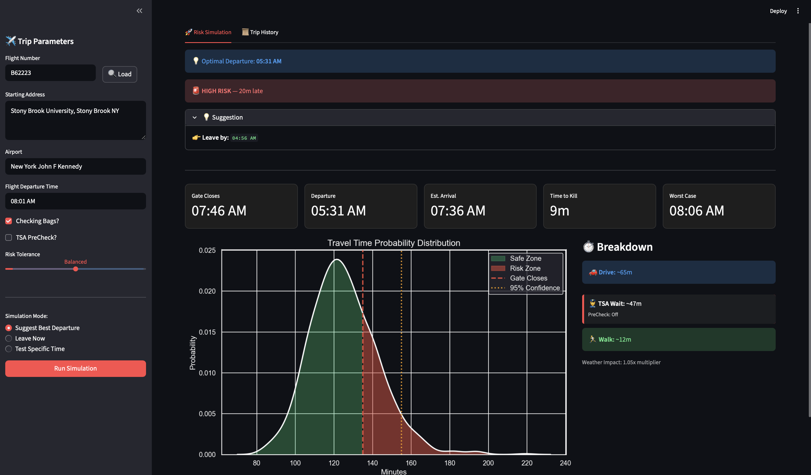
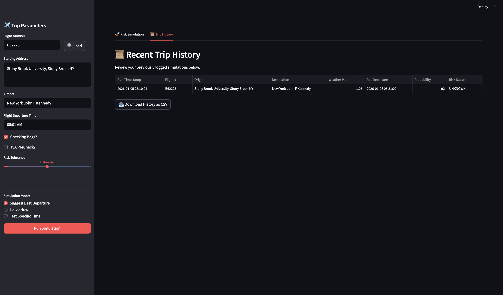

# ✈️ FlightRisk v3.0: Stochastic Travel Intelligence
### *Because "Average ETA" is a gamble. Predict your risk with 95% certainty.*

Standard navigation apps tell you when you'll arrive *on average*. But if a $400 flight closes its gate in 60 minutes, the average doesn't matter—the **tail-end risk** does. **FlightRisk v3.0** is a full-stack predictive engine that replaces static estimates with a **1,000-trial Monte Carlo simulation**, accounting for traffic volatility, terminal congestion, and hyper-local weather.

---

## 🧠 The Statistical Stack (How it Works)

I built this project to apply **Queue Theory** and **Stochastic Modeling** to a real-world logistics problem. The system fusions four specialized engines:

### 1. 🚦 TrafficEngine (Triangular Distribution)
Fetches data from the **Google Directions API** (Optimistic, Best Guess, and Pessimistic durations). 
* It treats these as `min`, `mode`, and `max` values to build a **Triangular Distribution**.
* This simulates the reality that traffic delays are "right-skewed"—it is mathematically easier to be 20 minutes late than 20 minutes early.

### 2. ⛈️ WeatherEngine (Gaussian Noise Factor)
Uses the **OpenWeather API** to perform spatial sampling along the route polyline.
* Weather severity at the origin and airport is mapped to a **Normal Distribution**.
* This acts as a "Volatility Multiplier" on the traffic data, expanding the variance during active storms.

### 3. 🛡️ AirportEngine (Gamma Distribution Queue Theory)
Airport wait times (TSA, Bag Drop, Check-in) follow a **Gamma Distribution** to model the "long-tail" risk of unexpected bottlenecks.
* **Tiered Logic:** The model distinguishes between **Tier 1 Hubs** (JFK, ATL) and **Tier 2 Regional** airports to adjust wait-time variance.

[Image of a Gamma distribution probability density function]

### 4. 🧮 RiskEngine (Monte Carlo Integration)
The system aggregates 1,000 samples from the engines to generate a **Probability Density Function (PDF)**.
* It calculates the **P95 Arrival Time**—the time by which you will arrive in 95% of simulated universes.

---

## 🖥️ Technical Walkthrough: The UI

The v3.0 Dashboard is designed for high-stakes decision-making, emphasizing **interpretability** and **actionability**:

* **Interactive Risk Sliders:** Allows users to choose between *Conservative* (95% confidence), *Balanced* (85%), or *Aggressive* (75%) strategies.
* **The "Leave Now" Mode:** Calculates the immediate probability of arrival based on current system time for travelers in transit.
* **KDE Risk Profile:** A Seaborn-rendered plot that visually separates the "Safe Zone" (green) from the "Missed Flight Zone" (red) relative to strict gate-closure deadlines.
* **Trip History:** A persistence-backed tab utilizing **Pandas** to display previous runs from the **SQLite** database, allowing for CSV export and auditability.

---

## 🔌 API & Data Integration

FlightRisk is powered by a live data-fusion pipeline:
* **Google Directions API:** Real-time traffic, distance, and route polylines.
* **OpenWeather API:** Real-time weather conditions for origin and destination coordinates.
* **AeroDataBox API:** Live flight status lookups and automated **-15m Gate Closure** deadline calculation.

---

## 🛠 File Architecture (Modular OOP)

* `app.py`: Reactive **Streamlit** dashboard with a History tab and CSV export.
* `solver.py`: Recursive search algorithm identifying the "Latest Safe Departure."
* `flight_engine.py`: Handles live flight validation and automated **-15m Gate Closure** deadlines.
* `airport_engine.py`: Simulates terminal processing using Gamma-distribution queue modeling.
* `database.py`: **SQLite** persistence layer using the Context Manager pattern for trip logging.
* `visualizer.py`: Custom Matplotlib/Seaborn wrapper for rendering the P95 Risk Profile.

---

## 🚦 Installation

1.  **Clone:** `git clone https://github.com/Brycewhi/FlightRisk.git`
2.  **Install:** `pip install -r requirements.txt`
3.  **Config:** Create a `.env` file with your API keys (Google, OpenWeather, RapidAPI).
4.  **Run:** `streamlit run app.py`

---

## 📈 Roadmap

* **v3.5:** Implement `asyncio` to parallelize multi-engine API requests, reducing total latency by ~60%.
* **v4.0:** Port simulation loops to **C++/PyBind11** for high-performance computation to scale to 100k+ trials.

* **v4.5 [ML Feedback Layer]:** * Implement a regression model to analyze `trip_history` data from SQLite.
    * Use actual vs. predicted arrival deltas to dynamically tune the **Shape ($\alpha$)** and **Scale ($\beta$)** parameters of the AirportEngine’s Gamma distributions.
    * Transform static heuristics into a learning system that improves accuracy with every logged trip.

---
**Developed by Bryce Whiteside** *Applied Mathematics & Computer Science | Stony Brook University* 