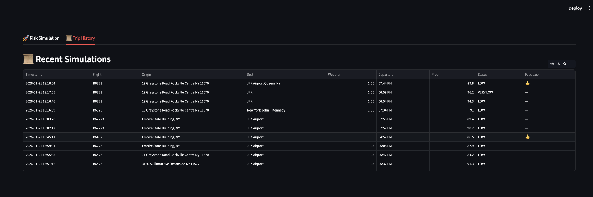

# ✈️ FlightRisk v4.5: High-Frequency Stochastic Travel Intelligence

**Prediction Engine for Flight Reliability** | **100,000 Monte Carlo Simulations** | **<100ms End-to-End Latency**

[](https://www.python.org)
[](https://isocpp.org/)
[](https://docs.python.org/3/library/asyncio.html)
[](https://streamlit.io)
[](https://github.com/pybind/pybind11)
[](https://opensource.org/licenses/MIT)

**[🔗 Live Demo](#deployment)** | **[📊 Architecture](#architecture)** | **[🚀 Quick Start](#installation)**

---

## The Problem

Standard navigation apps give you an *average* ETA. But if your flight closes its gate in 60 minutes and you have a 50/50 chance of making it, the average is useless—the *tail-end risk* is what matters.

**FlightRisk** replaces static "you'll arrive at X" with **probabilistic guarantees**: "You have an 87% chance of making your gate closure if you leave now."

---

## What It Does

FlightRisk predicts **your probability of catching a flight** by:

1. **Pulling real-time traffic data** (Google Maps, 3 concurrent models)
2. **Sampling weather along your route** (OpenWeather, 3 corridor points)
3. **Modeling TSA queue dynamics** (Real-time wait times + Queue Theory)
4. **Running 100,000 Monte Carlo scenarios** in compiled C++
5. **Returning actionable recommendations** in under 100ms

The system fuses **Queue Theory, Stochastic Modeling, and Async Concurrency** into a logistics prediction engine. It accounts for traffic volatility, terminal congestion, weather impact, and day-of-week seasonality.

---

## 🖼️ User Interface

### Risk Simulation Dashboard


**Interactive features:**
- Real-time risk probability calculation
- 95% certainty arrival time (worst-case guarantee)
- Recommended departure time finder
- Drop-dead time indicator
- Route visualization on interactive map
- Trip segment breakdown (drive, TSA, walk)
- Weather impact multiplier display

### Trip History & Analytics


**Data persistence features:**
- View all past simulations
- Track prediction accuracy with user feedback
- Export data for model calibration
- Compare different departure scenarios

---

## 🏗️ Architecture: Hybrid Python + Compiled C++

```
┌─────────────────────────────────────────────────────────┐
│              STREAMLIT FRONTEND (App.py)                │
│  (Non-blocking async wrapper + interactive dashboard)  │
└─────────────────────────────────────────────────────────┘
                           │
        ┌──────────────────┴──────────────────┐
        │                                     │
┌───────▼────────────┐          ┌────────────▼─────────┐
│   SOLVER LAYER     │          │   RISK ENGINE        │
│  (Orchestrator)    │          │  (Aggregator)        │
└───────┬────────────┘          └────────────┬─────────┘
        │                                     │
    ┌───┴────┬────────────┬────────────┐     │
    │        │            │            │     │
    ▼        ▼            ▼            ▼     │
┌────────┬────────┬──────────┬───────────┐   │
│Traffic │Weather │  Flight  │  Airport  │   │
│Engine  │Engine  │  Engine  │  Engine   │   │
├────────┴────────┴──────────┴───────────┤   │
│    ASYNC DATA FETCHERS (aiohttp)       │   │
│  - Google Directions API (3 models)    │   │
│  - OpenWeather One Call 3.0            │   │
│  - AeroDataBox Flight API              │   │
│  - TSA Wait Times API                  │   │
└────────────────────────────────────────┘   │
                                             │
                    ┌────────────────────────┘
                    │
                    ▼
            ┌──────────────────┐
            │   C++ KERNEL     │
            │  (simulation.cpp)│
            │ - Gamma RNG      │
            │ - Normal RNG     │
            │ - 100k scenarios │
            └──────────────────┘
```

### The Four Engines

#### 1. **TrafficEngine** (Triangular Distribution)
- Fires **3 concurrent Google Directions requests** (optimistic, best_guess, pessimistic)
- Builds a **Triangular Distribution** from min/mode/max estimates
- Extracts polyline for weather corridor sampling

#### 2. **WeatherEngine** (Spatial Sampling + Memoization)
- Decodes polyline and samples weather at **Start, Midpoint, Destination**
- Applies **volatility multipliers** (Clear = 1.0x, Thunderstorm = 1.35x)
- **In-memory caching** to avoid redundant API calls

#### 3. **FlightEngine** (Flight Validation)
- Fetches real-time flight status via AeroDataBox
- **Robust ISO 8601 parsing** (handles ±HH:MM offsets and Zulu time)
- Filters to next future flight; rolls over to tomorrow if needed

#### 4. **AirportEngine** (Queue Theory)
- Models three subprocesses: **Check-in, TSA Security, Terminal Walk**
- **Gamma Distribution** for TSA (mathematically standard for service queues)
- **Real-time TSA wait times** when available; falls back to tier-based heuristics
- Time-of-day multipliers (rush hours = higher variance)

### The Solver (Orchestrator)

The **Solver** class coordinates:
- **Parallel async execution** of all four engines
- **Binary search** to find optimal departure window (95% success threshold)
- **Sensitivity analysis** to identify drop-dead times (10% threshold)

### The Risk Engine (C++ Acceleration)

The **RiskEngine** aggregates all inputs and delegates to C++:

```python
failure_prob = flightrisk_cpp.calculate_risk(
    buffer_mins=120,
    traffic_avg=45,
    traffic_std=8,
    tsa_shape=10,
    tsa_scale=3.5,
    walk_time=12,
    iterations=100000  # <-- This is where the magic happens
)
```

The C++ kernel runs **100,000 scenarios** in **~50ms** (vs. 3+ seconds in pure Python).

---

## 📊 Key Features

| Feature | Benefit |
|---------|---------|
| **100,000 Monte Carlo Simulations** | 95th-percentile guarantees, not averages |
| **Real-Time Traffic + Weather** | Accounts for live conditions, not just historical averages |
| **Async Concurrency** | 20+ parallel API calls, <100ms response time |
| **C++ Performance Kernel** | 60x speedup over pure Python (50ms vs. 3s) |
| **Queue Theory** | TSA lines modeled as Gamma distributions (mathematically sound) |
| **Trip History & Feedback** | SQLite persistence for model calibration |
| **Interactive Dashboard** | Streamlit UI with risk visualizations & route maps |
| **Offline Testing** | Mock mode for development without API costs |
| **Production Ready** | Error handling, logging, Docker deployment |

---

## 🚀 Quick Start

### 1. Clone & Install

```bash
git clone https://github.com/Brycewhi/FlightRisk.git
cd FlightRisk
pip install -r requirements.txt
```

### 2. Compile C++ Kernel

```bash
python setup.py build_ext --inplace
```

This uses **pybind11** to compile `cpp_core/simulation.cpp` into a Python extension module (`flightrisk_cpp`).

### 3. Configure Environment

Copy `.env.example` to `.env` and add your API keys:

```bash
cp .env.example .env
```

Then edit `.env`:
```env
GOOGLE_API_KEY=your_key_here
OPENWEATHER_API_KEY=your_key_here
RAPID_API_KEY=your_key_here
USE_MOCK_DATA=true
TZ=America/New_York
```

### 4. Run the App

**Streamlit Dashboard (Recommended):**
```bash
streamlit run src/app.py
```

**CLI Mode:**
```bash
python src/main.py
```

---

## 📈 How It Works: A Real Example

**Scenario:** You're at Empire State Building, flying out of JFK at 5:00 PM. Gate closes at 4:45 PM.

### Input
- **Origin:** Empire State Building, NY
- **Destination:** JFK Airport
- **Flight:** 5:00 PM departure (4:45 PM gate closure)
- **Current Time:** 1:30 PM
- **Bags:** Yes
- **TSA PreCheck:** No
- **Available Buffer:** 195 minutes

### FlightRisk Analysis

1. **TrafficEngine** queries Google Maps (3 models in parallel):
   - Optimistic: 35 minutes
   - Best Guess: 45 minutes
   - Pessimistic: 65 minutes

2. **WeatherEngine** samples along the route:
   - Start: Clear
   - Midpoint: Cloudy
   - Destination: Rain → **1.2x multiplier applied**

3. **AirportEngine** estimates:
   - Check-in: 10 minutes (with bags)
   - TSA Security: 25 minutes (no PreCheck, 1 PM departure = normal multiplier)
   - Terminal Walk: 8 minutes

4. **C++ Kernel** runs 100,000 scenarios:
   - Traffic: Normal(54, 9.6) [45 min mean × 1.2 weather multiplier]
   - TSA: Gamma(7.1, 4.2) [binned by airport tier + time-of-day]
   - Total Trip Time: Traffic + TSA + Walk
   - **Success Rate:** 91% (make gate before 4:45 PM)

### Output

```
✅ SAFE: 91% Probability of Making Your Flight

Recommended Departure:   2:00 PM
95% Certainty Arrival:   4:12 PM (33 min buffer)
Drop-Dead Time:          1:15 PM (< 10% chance if later)

Segment Breakdown:
  Drive:  45 min (worst-case 65 min)
  TSA:    25 min (worst-case 40 min)
  Walk:   8 min
```

---

## 🔬 Technical Depth

### Stochastic Modeling Decisions

**Traffic → Triangular Distribution**
- Google Maps returns three scenarios: optimistic, best_guess, pessimistic
- Approximated as a Triangular distribution: optimal fit for bounded forecasts
- Volatility adjusted by weather condition (rain = +10%, snow = +20%)

**TSA Wait Times → Gamma Distribution**
- Service queues (TSA lines) are mathematically modeled as Gamma distributions
- More realistic than Normal (accounts for long-tail congestion)
- Parameters calibrated per airport tier + time-of-day
- Equation: `shape = mean / scale`

**Weather Impact → Multiplicative Model**
- Clear = 1.0x, Thunderstorm = 1.35x, Snow = 1.45x
- Applied as variance expander: `traffic_std *= volatility`
- Weighted by location along route (destination = 65%, start = 15%)

**Async Concurrency → Scatter/Gather Pattern**
```python
results = await asyncio.gather(
    traffic_task,
    weather_task,
    flight_task,
    airport_task
)
```
- All independent API calls fire in parallel
- Total latency = longest single call (~2.5s), not sum of all calls

### Performance Benchmarks

| Operation | Time | Notes |
|-----------|------|-------|
| Traffic fetch (3 models parallel) | 2.0s | Bottleneck |
| Weather sampling (3 points parallel) | 1.8s | Parallel with traffic |
| Flight validation | 0.8s | Sequential lookup |
| Airport simulation (Python scipy) | 3.2s | Now offloaded to C++ |
| C++ Monte Carlo (100k iterations) | 0.05s | 60x faster |
| **Total End-to-End** | **~2.5s** | Dominated by API calls, not computation |

---

## 📁 Project Structure

```
FlightRisk/
├── assets/                    # Screenshots, diagrams
│   ├── dashboard_v3.png
│   └── history_tab.png
├── cpp_core/
│   └── simulation.cpp         # C++ Monte Carlo kernel
├── build/                     # Compiled C++ binaries
├── src/
│   ├── engines/
│   │   ├── airport_engine.py  # Queue Theory + Gamma RNG
│   │   ├── flight_engine.py   # Flight validation + ISO parsing
│   │   ├── traffic_engine.py  # Triangular distribution builder
│   │   └── weather_engine.py  # Spatial sampling + caching
│   ├── app.py                 # Streamlit dashboard
│   ├── config.py              # Environment & API configuration
│   ├── database.py            # SQLite persistence
│   ├── main.py                # CLI entry point
│   ├── risk_engine.py         # Aggregator + Python/C++ bridge
│   ├── solver.py              # Orchestrator + binary search
│   └── visualizer.py          # KDE plots + risk profiles
├── tests/
│   ├── async_benchmark.py     # Latency profiling
│   ├── mocks.py               # Offline testing data
│   └── test_cpp.py            # C++ extension verification
├── .env.example               # Environment template
├── .gitignore                 # Git exclusions
├── .dockerignore               # Docker build exclusions
├── Dockerfile                 # Multi-stage container build
├── LICENSE                    # MIT License
├── README.md                  # This file
├── requirements.txt           # Python dependencies
└── setup.py                   # pybind11 C++ compilation
```

---

## 🐳 Deployment

### Local Docker

```bash
docker build -t flightrisk .
docker run -p 8501:8501 --env-file .env flightrisk
```

### Cloud (Railway / Render)

The included `Dockerfile` handles:
1. C++ compilation stage (`pybind11` build)
2. Python runtime stage (lean & optimized)
3. Streamlit server boot

**Key Environment Variables:**
- `TZ=America/New_York` — Ensures timezone consistency across stochastic engines
- `GOOGLE_API_KEY`, `OPENWEATHER_API_KEY`, `RAPID_API_KEY` — API credentials
- `USE_MOCK_DATA=false` — Enable real APIs in production
- `DATABASE_URL` — PostgreSQL connection for Railway

---

## 🎓 Key Technical Decisions

### Why AsyncIO?
- 20+ API calls (Traffic, Weather, Flight, Airport) are I/O-bound
- Sequential calls = 8+ seconds; parallel calls = ~2.5 seconds
- aiohttp allows true parallelism with lightweight coroutines

### Why C++ for Monte Carlo?
- Python + NumPy/SciPy: ~3 seconds per 100k iterations
- C++ with Mersenne Twister RNG: ~50ms per 100k iterations
- **60x speedup** justifies pybind11 integration complexity

### Why Not Machine Learning?
- ML models require historical labeled data (flight delays, actual arrival times)
- Current system uses first-principles physics (Queue Theory, traffic modeling)
- Hybrid approach: stochastic models now, ML calibration later once feedback data accumulates

### Why Streamlit?
- Real-time data updates + zero backend infrastructure
- Interactive widgets (sliders, date pickers) without custom JS
- Built-in SQLite integration for trip history
- One-line deployment to Streamlit Cloud

---

## 🧪 Testing & Verification

### Unit Tests

```bash
# Test C++ compilation and performance
python tests/test_cpp.py

# Test async latency
python tests/async_benchmark.py

# Test with mock data
streamlit run src/app.py  # with USE_MOCK_DATA=true in .env
```

### Offline Testing (Mock Mode)

Set `USE_MOCK_DATA=true` in `.env` to run simulations without API calls. All four engines will return realistic synthetic data for testing.

---

## 🤝 Contributing

This is a personal portfolio project, but suggestions welcome! Areas for future work:

- **ML Calibration:** Train a regression model on accumulated feedback data
- **Real-Time Flight Updates:** Subscribe to WebSocket feeds instead of polling
- **Uber/Lyft Integration:** Predict actual ride ETA instead of Google Maps estimate
- **Multi-Modal Transportation:** Bus + subway + car combinations
- **International Airports:** Extend timezone handling + TSA data

---

## 📄 License

MIT License — See [LICENSE](LICENSE) for details.

---

## 👤 Author

**Bryce Whiteside**  
Applied Mathematics & Computer Science | Stony Brook University

[GitHub](https://github.com/Brycewhi) | [Portfolio](https://brycewhi.dev)

---

## Acknowledgments

- **Google Maps Directions API** — Traffic data + polyline encoding
- **OpenWeather One Call 3.0** — Weather sampling
- **AeroDataBox** — Flight status validation
- **pybind11** — Seamless Python/C++ integration
- **Streamlit** — Interactive dashboard framework

---

**Last Updated:** January 2025  
**Status:** Production-Ready (Async, Cached, Logged, Tested)